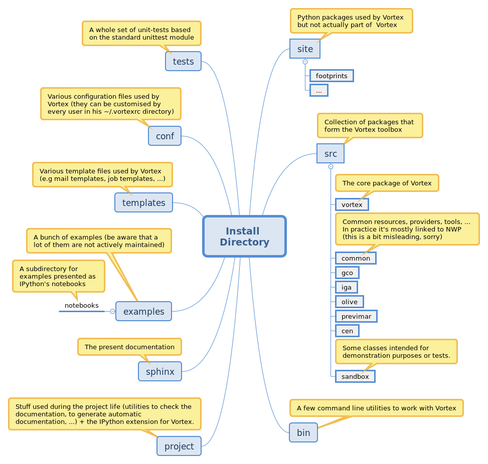

.. _getting-started:

Getting Started
###############

Introduction
************

Vortex (**V**\ersatile **O**\bjects **R**\ounded-up in a **T**\oolbox for **E**\nvironmental e **X**\periments)
is a software package designed to run simple to complex numerical workloads an a
large variety of systems. 

The Vortex Toolbox main objectives
==================================

Looking back at the Vortex acronym, it is clearly stated that Vortex is a **T**\oolbox
meaning that Vortex alone won't be able to run any kind of workload. Instead,
it offers building blocks to create scripts supporting a large variety of
workloads. The complexity of managing data, running complex programs on various
architectures, ... should remain hidden in the toolbox allowing the end-user,
responsible for writing the script, to focus on the description of the workflow.

It is **V**\ersatile in a sense that it should be able to perform on various
architectures and in different sites. Consequently, given the same script, the
toolbox may behaves differently depending on the context. This can be achieved
using the full flexibility of object oriented programming.

Vortex can help with:

* Data management;
* Recording what's been done (in order to act appropriately);
* Running complex programs (but also very simple scripts);
* Communicating with the outside world (by providing tools acting as gateways to external services);
* Creating tasks and jobs using a templating system.

Although Vortex has initially been created to run Numerical Weather Prediction
on a super-computer, it is generic enough to be used with other kinds of workloads
and servers.

In the following five sub-sections, we will have a closer look to each of these
key features. 

.. _getting-started-data1:

Data Management
===============

From a user point of view, data should be described in a functional way as 
precisely as possible. However the hassle of actually locating and getting the
data remains the toolbox prerogative.

.. topic:: Example

   This could be considered a valid data description:
   "Gridpoint data (on the GLOB05 grid, in GRIB format) of the Arpège model
   at term 3h of the  01/06/2017 18UTC run for the second member of the e-suite's
   PEARP configuration from the Meteo-France's mass archive". In contrast, the raw
   data location   
   (``ftp://hendrix.meteo.fr/~mxpt001/vortex/arpege/pearp/DBLE/2017/06/01/T1800P/mb002/forecastgrid.arpege-forecast.glob05+0003:00.grib``)
   shall not be used.

Clarity set aside, it allows Vortex to :

* Fetch data from various locations
* Account transparently for any specific data format (e.g. when moving around LFI
  files a dedicated move command should be used instead of the usual system 'mv') 
* Optimise some data movements through caching mechanisms
* Be independent of any system migration (e.g the location of the target data 
  may change because of a system upgrade, ...)

The classes structure in the Vortex package reflects this descriptive approach:

* The classes deriving from :class:`vortex.data.resources.Resource` represent
  what is in the data (e.g. "Gridpoint data (on the GLOB05 grid, in GRIB format)
  of the Arpège model at term 3h of the  01/06/2017 18UTC")
* The classes deriving from :class:`vortex.data.providers.Provider` represent
  where to  get/put the data (e.g. "The second member of the e-suite's
  PEARP configuration from the Meteo-France's mass archive")
* The classes deriving from :class:`vortex.data.containers.Container` represent
  where the data will be stored locally (usually this is a file or directory, 
  but data can also be stored in memory)

Instances of these three classes are mandatory to manipulate data with Vortex. Therefore they
are aggregated in a :class:`vortex.data.handlers.Handler` object that will use
the :class:`~vortex.data.resources.Resource` and :class:`~vortex.data.providers.Provider` 
objects to determine the remote location of the data (see the 
:meth:`~vortex.data.handlers.Handler.location` method). This location will be an URI
(Uniform Resource Identifier) that looks like the one used in web browsers. Given
this URI, an object based on :class:`vortex.data.stores.Store` will be created in order to
effectively fetch or put the data into/from the location described by the 
:class:`~vortex.data.containers.Container` object. (*Note:* The  :class:`~vortex.data.stores.Store`
object creation is done transparently by the :class:`~vortex.data.handlers.Handler`
object when methods :meth:`~vortex.data.handlers.Handler.get` or
:meth:`~vortex.data.handlers.Handler.put` are called). 

This allow for a large variety of data sources since the only limitation is
basically the availability of appropriate :class:`~vortex.data.providers.Provider`
and :class:`~vortex.data.stores.Store` classes. Flexibility is inherent to this approach
since :class:`~vortex.data.stores.Store` objects may behave differently depending
on the configuration. 

.. seealso::
   ???

.. _getting-started-context:

Recording what's been done and more generally session management
================================================================

Inside the toolbox, it is often useful to know which files have been fetched
(to act accordingly), which file have been sent (to avoid sending it
twice), which environment variables are currently being used (in order to make temporary
changes), ... Moreover, it's frequently needed to access basic system functions, 
to check user permissions and so on.

In Vortex, the gateway to all this is a :class:`vortex.sessions.Ticket` object.
A default :class:`~vortex.sessions.Ticket` object (tagged ``root``) is created
automatically when the ``vortex`` package is imported (most of the time, it will
be enough to use this default session :class:`~vortex.sessions.Ticket`).

At a given time, there is only one active session represented by its 
:class:`~vortex.sessions.Ticket`. It can easily be fetched from everywhere within 
the toolbox or the user script using the :meth:`vortex.ticket()` or 
:meth:`vortex.sessions.get()` methods (the two are equivalent).

The :class:`~vortex.sessions.Ticket` object gives access to many interesting objects:

* The session's :class:`vortex.gloves.Glove` object (accessible through the 
  :attr:`~vortex.sessions.Ticket.glove` property) that contains information
  about the global configuration (e.g. user logname, user profile, ...).
* The session's :class:`vortex.tools.systems.System` like object (accessible through 
  the :attr:`~vortex.sessions.Ticket.sh` property) that provides plenty of
  methods to leverage basic system commands (*e.g.* ``cp``, ``mv``, ``hostname``, ...)
  or  more advanced tools (*e.g.* ftp, ssh, ...). It should be noted that the 
  :class:`~vortex.tools.systems.System` class is chosen at runtime depending on
  the Operating System (OS) type and the Python interpreter version, thus allowing for
  OS specific implementations of some system commands. It creates a simpler user
  experience since one just needs to use the :class:`~vortex.tools.systems.System`
  like object methods without worrying of the underlying Operating System.
* The current active :class:`vortex.layout.contexts.Context` object (accessible
  through the :attr:`~vortex.sessions.Ticket.context` property). Within a 
  session, several :class:`~vortex.layout.contexts.Context` objects might exist
  (since Contexts may have sub-Contexts) but there is only one active Context at
  a time.

The main purpose of the :class:`~vortex.layout.contexts.Context` objects is to
track user actions (like fetching data) and alterations to the environment
variables:

* The context's :class:`vortex.layout.dataflow.Sequence` object (accessible
  through the :attr:`~vortex.layout.contexts.Context.sequence` property) maintains
  a list of input and output data. It is queryable using various methods provided
  by the :class:`~vortex.layout.dataflow.Sequence` class.
* The latest active :class:`vortex.tools.env.Environment` object for the present
  context (accessible through the :attr:`~vortex.layout.contexts.Context.env` 
  property) can be used to access, modify or delete environment variables. Within
  a context, :class:`~vortex.tools.env.Environment` can be duplicated allowing
  to make temporary changes and switch back to the previous state whenever
  appropriate.  

Although these classes play a crucial role in Vortex inner working, the user
should not worry to much about them since session's :class:`~vortex.sessions.Ticket`, 
:class:`~vortex.layout.contexts.Context` and :class:`~vortex.tools.env.Environment`
objects should be managed by the template-based job creation system (see, the 
:ref:`getting-started-jobs` section below). Accessing the current active object is
usually enough:

.. code-block:: python

   >>> import vortex
   Vortex X.X.X loaded ( Tuesday 01. August 2017, at 13:29:14 )
   >>> t = vortex.ticket()  # Getting the current active session's ticket
   >>> print t.idcard()  # Print some informations about the session
   + Name     = root
   + Started  = 2017-08-01T13:29:14.632805Z
   + Opened   = True
   + Duration = 0:01:47.986224
   + Loglevel = INFO
   >>> print t.glove.idcard()  # Print some informations about the glove
   + User     = meunierlf
   + Profile  = research
   + Vapp     = play
   + Vconf    = sandbox
   + Configrc = /home/meunierlf/.vortexrc
   >>> sh = t.sh  # Getting the active session's system
   >>> print sh.hostname
   lxgmap45
   >>> ctx = t.context  # Getting the active context
   >>> print 'There are {:d} environment variables in the current env'.format(len(ctx.env))
   There are 117 environment variables in the current env

.. seealso::
   * A technical documentation (intended for developers): :ref:`env-interface`

Running complex programs
========================

Most of the time, running a program is not only "launching" it. It is usually 
needed to:

* Take into account distinctive features of the execution target such as:
   * System libraries and softwares (e.g. the various flavours of MPI implementations)
   * OS specific settings (e.g the maximum stack size)
* Account for program specific settings:
   * Some command line argument may be needed
   * Some environment variable may need to be positioned
   * Some kind of configuration files may need to be updated or even created (e.g. namelists)
   * Some input files may need renaming
   * When the program itself is done, some actions may be needed (e.g. generate
     some kind of report)

For all those reasons, dedicated classes are available in Vortex. They all derive
from the :class:`vortex.algo.components.AlgoComponent` abstract class and can 
be of various complexity:

* Simply running a binary or script (see :class:`vortex.algo.components.BlindRun`
  and :class:`vortex.algo.components.Expresso`)
* Running a complex MPI program in background in order to process a large number of
  files.

Such classes may rely on other Vortex's modules (such as the
:mod:`vortex.algo.mpitools` module that takes care of running MPI programs) or
even external packages (such as :mod:`taylorism`). 

Communicating with the outside world
====================================

In addition to the interface with the operating system (see the :class:`~vortex.tools.systems.System`
like classes), several interfaces to various external tools are provided. They are
implemented in classes deriving from the :class:`vortex.tools.actions.Action`
class. They all share some basic features:

* The access to some actions might be restricted to a few users (using adequate
  configuration files)
* An action can be activated/deactivated: it allows to discard calls to a 
  given external tool without having to change the scripts, tasks or jobs.
* Since actions may be deactivated they should be thought as optional (i.e. the
  script, task or job must be able to run even if a particular action is 
  deactivated)

Some example of available :class:`~vortex.tools.actions.Action` classes are:

* The :class:`~vortex.tools.actions.SendMail` action (with an obvious purpose...)
* The :class:`~vortex.tools.actions.FlowSchedulerGateway` action that ease
  communications with workflow schedulers such as SMS our ecFlow.

Also :class:`vortex.tools.actions.Action` like classes can be called directly, it
is advised to use them through the default action dispatcher:

.. code-block:: python

   >>> import vortex
   Vortex X.X.X loaded ( Tuesday 01. August 2017, at 15:00:41 )    
   >>> from vortex.tools.actions import actiond as ad
   >>> ad.mail(to='louis-francois.meunier@meteo.fr', smtpserver='smtp.meteo.fr',
   ...         subject='demo', message='Vortex says Hi :-)\n')

.. seealso::
   * A technical documentation (intended for developers): :ref:`actions-usage`

.. _getting-started-jobs:

Creating Tasks and Jobs
=======================

The part of the Vortex toolbox related to tasks and jobs management is optional
in a sense that it's perfectly fine to use the Vortex toolbox in a custom script,
a command line tool or whatever. However, when it comes to Meteo-France's
operational suite, all scripts must be implemented using Vortex's default tasks
and jobs management tool.

Here is a short introduction to this management tool :

* A "job" is a script runnable on the execution target (either directly or 
  through a workload manager). It is usually auto-generated using a templating
  system.
* At some point, the "job" script will create an object deriving from the 
  :class:`vortex.layout.jobs.JobAssistant` class. This 
  :class:`~vortex.layout.jobs.JobAssistant` will be used to setup the session,
  actions, and the system that will subsequently be used to do the actual
  work. It is also in charge of handling Python's exception that may be raised
  during the execution.
* Once the :class:`~vortex.layout.jobs.JobAssistant`'s setup is done, a 
  :class:`vortex.layout.nodes.Driver` object will be created. It is in charge
  of running sequentially one or more "tasks" (or "families" of tasks).
* The task is the finest level of granularity. It's a class deriving from
  :class:`vortex.layout.nodes.Task` where the developer redefines the 
  :meth:`~vortex.layout.nodes.Node.process` method. The :meth:`~vortex.layout.nodes.Node.process`
  method needs to be organised as a sequence of:

   1. Input statements for data that can be fetched well in advanced (e.g from the 
      mass archive)
   2. Input statements for data that can only be fetched at the last moment 
      (typically, data produced by a previous task of the same job)
   3. Calls to one or more :class:`~vortex.algo.components.AlgoComponent` objects
      (*Note:* because it helps with debugging, it is desirable to call only one 
      :class:`~vortex.algo.components.AlgoComponent`)
   4. Output statements for data that will be needed soon after the present task 
      (typically, data needed by a subsequent task of the same job)
   5. Output statements for other data (e.g. data used in other subsequent jobs or
      data that need to be archived).

* The :class:`~vortex.layout.nodes.Driver` and :class:`~vortex.layout.nodes.Task`
  classes provide an easy access to a job wide (or even application wide)
  configuration file. This feature should be leveraged in order to build flexible
  tasks. 

The :class:`~vortex.layout.nodes.Driver` and :class:`~vortex.layout.nodes.Task`
classes will take care of setting up :class:`~vortex.layout.contexts.Context`
objects (mentioned in the :ref:`getting-started-context` section above). Each
task will run with a dedicated active :class:`~vortex.layout.contexts.Context` 
object which implies that:

* Each task will run in a dedicated directory ;
* Each task will start from a clean list of environment variableq and changes
  made in one task won't influence any other task.

This (painless) isolation feature should prevent bugs that otherwise are very 
difficult to track down.

.. seealso::
   ???

Vortex, a world of footprints
*****************************

Internally, the :mod:`footprints` package is widely used in Vortex: you will not
have to modify it directly (it's been very stable) but you will ear a lot about
it. For design patterns fans, a simple way to put it is that :mod:`footprints` implements 
a very flexible factory pattern. For normal people, we can say that :mod:`footprints`
maintains a catalogue of available classes for a given category (for example,
resources, providers, ...). when A user wants to create an object, he provides
:mod:`footprints` with a list of arguments for the object constructor; from this list of
arguments, :mod:`footprints` will be able to choose the class that best fits the needs
(i.e. the provided arguments) and, in turn, create the object.

.. topic:: Example
   
   * Let A be a class with the following attributes:

      * *kind* that only accepts values "analysis", "modelstate" and "gridpoint";
      * *model* that only accept the value "arpege".

   * Let B be a class with the following attributes:

      * *kind* that only accepts values "analysis" and "modelstate";
      * *model* that only accepts values "arpege" and "aladin".

   * If the user requests an object with *kind="modelstate"* and *model="arpege"*,
     an object of class A will be created
   * If the user requests an object with *kind="analysis"* and *model="aladin"*,
     an object of class B will be created
   * If the user requests an object with *kind="gridpoint"* and *model="aladin"*, 
     footprints will fail.

Despite the triviality of this example, :mod:`footprints` is a good mean to
enhance standard Python capabilities:

* :mod:`footprints` imposes a tight check on both the attribute's values and type,
  (this is possible in standard Python but somehow tedious);
* :mod:`footprints` allows optional attributes (when available, they are
  also thoroughly checked);
* Up to a certain point, when two classes have overlapping footprints (i.e. when
  arguments provided by the user satisfy several classes), :mod:`footprints`
  has a mechanism to determine a best choice;
* Since objects are not created directly, the structure of the code (packages, 
  modules and classes) doesn't matter anymore. It allows to perform deep
  refactoring on the code whenever needed (without any impact on the end-user); 
* :mod:`footprints` has the knowledge of all available classes for a given
  category. Consequently, it is possible to auto-generate documentation and
  to export catalogues to various formats (notably json and XML).

On the downside:

* The :mod:`footprints` code itself is complex and rely on advanced Python
  concepts such as meta-programming;
* For untrained users, :mod:`footprints` can produce obscure error messages. 

As can be seen in the following :ref:`getting-started-example`, :mod:`footprints`
is used to create Resource, Provider, Container and AlgoComponent objects.

.. note:: The :mod:`footprints` package is not directly linked to Vortex 
   consequently it could be used in other projects whenever the factory design
   pattern is needed. On the side, it also provides some useful utility classes
   and notably a fancy version of the observer pattern.

.. seealso::

   * A user documentation in french: :ref:`overview-footprints`
   * In Vortex, the footprint's catalogue of available *resources*, *providers*, *containers*
     and *algo-componnents* is browsable with `Vortex-Help <_static/vortex-help/index.html#http://>`_

.. _getting-started-example:

Introductory example
********************

This is a first example of a Python’s script using Vortex :

* It doesn't use the Vortex job management system (it would be to complex 
  for a first example);
* The explanations above are not enough to understand every bits of this 
  script: try not to focus to much on the technicalities but instead look for
  the general concepts;
* It should run on any workstation with Vortex installed and a configured FTP
  access to Meteo-France’s mass archive (``.netrc`` file with a
  ``hendrix.meteo.fr`` entry):
* For clarity sake, this example is presented in a Jupyter's notebook. 
  However, it should also run in a raw Python’s script

Please follow this link to view the example's Notebook: :ref:`nbook-00_getting_started`.

Migrating to Vortex
*******************

For end-users who start from existing Vortex scripts, it should be relatively
easy to customise scripts.

For application developers, for several reasons, there is a steep learning curve:

* The Vortex toolbox is already quite big and offers a lot of possibilities:
  it's a lot to learn;
* The Vortex documentation does not cover everything and, let's be honest, it 
  never will. Therefore, at some point, it will be necessary to have a look
  inside the Vortex toolbox code;
* For those coming from the Bash/Ksh world, switching to an object oriented
  language can be a difficulty in itself;
* Migrating existing scripts to another language is not exactly fun.

Nonetheless, our hope is that it will be beneficial in the long term:

* The migration to new compute architectures should be easier;
* The cooperation around a common toolbox makes available a lot of tools;
* Using a common toolbox to manipulate data will make cooperation between
  the various teams easier;
* Our experience with the Olive-Perl toolbox shows that the maintenance cost
  of such a toolbox is relatively low (especially when dealing with a large
  number of applications) and a lot of things are shared among different
  configurations;
* The process of having an R&D application running operationally should be
  simplified by the use of a common toolbox.  

Getting Vortex
**************

The Vortex code is managed in a Git repository (dedicated pages are available on
the `project's wiki <http://vortex.meteo.fr/vortex/doku.php>`_).

For major versions, Tar files are available on the `project's Redmine page
<https://opensource.umr-cnrm.fr/projects/vortex/files>`_.

Prerequisites:

* Python 2.7 (the code is not fully compatible with Python 3)
* The six package
* The nose package (optional, needed to run unit-tests)
* The sphinx-build utility >= 1.4  (optional, needed to build the documentation)
* IPython + nbconvert >= 5.0 (optional, needed to build the documentation)
* GNU make (optional, needed to build the documentation and run the unit-tests)

Let's assume that you have fetched the code (from Git or the Tar files) and that
it lies in the ``$VORTEXBASE`` directory. To be able to run Vortex scripts, you
will just need to add to the Python's path the following directories:

* ``$VORTEXBASE/site``
* ``$VORTEXBASE/src``
* ``$VORTEXBASE/project`` (optional, but recommended if you want to work with IPython)  

There are several ways to do that; pick the one you prefer: modify the ``$PYTHONPATH``
environment variable, tweak the ``sys.path`` list directly in the Python's script,
setup the Python's path in your favourite IDE (Eclipse, PyCharm, ...)

Once this is done, you should be able to use Vortex. However, you might want to
perform some customisations:

* By default, if Vortex needs to use a cache directory when manipulating data, 
  it will look for environment variables named ``$MTOOLDIR``, ``$FTDIR``, ``$WORKDIR``,
  ``$TMPDIR`` and, if none of them are defined, will use ``/tmp`` as a last
  resort. Consequently, you might tweak the ``$MTOOLDIR`` environment variable to
  indicate an alternative location (Note: Cleaning the cache directories is your
  responsibility).
* By default, when Vortex needs to access a mass archive system, it will use 
  Meteo-France's one. It is not necessarily what you need so you may specify
  an alternative network name using the ``$VORTEX_DEFAULT_STORAGE`` environment
  variable.
* It is possible to do even more customisations by created a dedicated
  ``target-XXX.ini`` configuration file for your machine. However, this will not
  be described in this short "Getting Started" page.

The code package organisation
*****************************

Here is a diagram that lists the sub-directories of the code package: 

   (Xmind source of this image: :download:`InstallDirectory.xmind`)

* The Vortex toolbox is divided into several packages (in the ``src`` 
  sub-directory):
 
   * the :mod:`vortex` package is the core of the toolbox. Everybody should
     import it;
   * the :mod:`gco` package provides access to the GCO database for constant
     files. Consequently nearly every body will import it. Internally, It can 
     use modules and classes from the :mod:`vortex` package
   * the :mod:`common` package contains a lot of common tools + resources and
     AlgoComponent related to NWP. Internally, It can use modules and classes 
     from the :mod:`vortex` and :mod:`gco` packages.
   * Other packages are designed for specific needs and should only be imported
     when necessary. Consequently, they should all be independent from one
     another (e.g the :mod:`iga` package may use/extend classes from the 
     :mod:`vortex`, :mod:`gco` or :mod:`common` packages, but should not use at all
     the :mod:`previmar` package).

* Because the Vortex toolbox is scattered in several packages, it can be
  difficult to walk trough the inheritance tree of classes (a powerful IDE
  like Eclipse or PyCharm helps a lot). For example, one really have to keep in
  mind that a resource defined in the :mod:`previmar` package may inherit from 
  a resource defined in the :mod:`common` (that will itself inherit from a
  resource defined in the :mod:`vortex` package).
* Although Vortex is toolbox, a few scripts are provided in the ``bin`` 
  sub-directory. They can be handy but should not be used in routine
  operational scripts.
