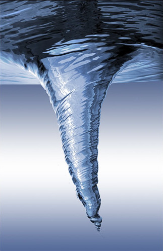

.. VORTEX documentation master file

VORTEX v |version| documentation
================================

Welcome!

This is the documentation for Vortex |version|, last updated |today|. 

Contents
--------

.. toctree::
   :maxdepth: 1

   Getting Started <gettingstarted>
   A step by step introduction <stepbystep/index>
   Extra Technical Documentation <technical/index>

The following documents are automatically generated from the source code
repository (they may contain detailed informations on specific classes and
method but may be a bit obscure for a first look at Vortex):

.. toctree::
   :maxdepth: 1
   
   The Vortex Standard Library <library/libindex>

Vortex is shipped with additional packages that are leveraged in Vortex but
may also be used independently (they are hosted in the ``site`` sub-directory):  

.. toctree::
   :maxdepth: 1
      
   Site Packages Standard Libraries <library/siteindex>

Extras
------

.. toctree::
   :maxdepth: 1

   List of default geometries (from geometries.ini) <geometries>
   List of default pollutant elements (from pollutants-elements-std.ini) <pollutants-elements-std>
   List of default pollutant sites (from pollutants-sites-std.ini) <pollutants-sites-std>
   checkreport
   Vortex-Help <_static/vortex-help/index.html#http://>

.. toctree::
   :maxdepth: 1
   :hidden:

   tododoc

Indices and tables
------------------

* :ref:`genindex`
* :ref:`modindex`
* :ref:`search`
* :ref:`notebooks_sum`

.. toctree::
   :maxdepth: 1
   :hidden:

   notebooks/index
   