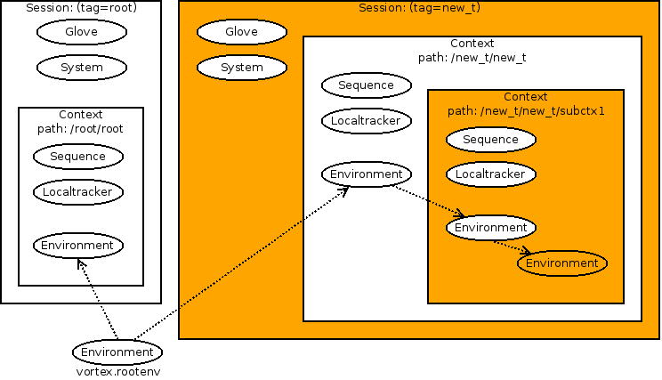

.. _env-interface:

**********************************
Understanding environment features
**********************************

What could be defined as a full featured environment is the combination
of four classes of objects :

* a vortex session :class:`vortex.sessions.Ticket`,
* a global versatile environment :class:`vortex.gloves.Glove`,
* an active context :class:`vortex.layout.contexts.Context`.
* an active environment binded to the operating system :class:`vortex.tools.env.Environment`.

A session Ticket always holds a root context that includes a root environment. A Glove
is associated to any session Ticket. Whether a ticket, context or environment remains
active, and what "active" means, is an other  matter and depends of the current usage.
For the time being, let say that at any time during a vortex experiment, one could be
aware of the current session, context and environment.

================
Default Behavior
================

Let's start with the default behaviour, assuming that the user does not want (yet?)
to hack things behind the scene.

The top level import
====================

At the very beginning, as soon as the import of the :mod:`vortex` module is done,
a :envvar:`rootenv` is defined. It remains directly accessible at any
time and should not be changed. It is the actual OS environment at launch time.

.. code-block:: python

  >>> import vortex
  >>> vortex.rootenv
  <vortex.tools.env.Environment object at 0x1284ad0>

A default session ticket (tagged *root*) is also defined. It could be retrieved
through the :func:`ticket` function:

.. code-block:: python

  >>> vortex.ticket()
  <vortex.sessions.Ticket object at 0x127ab90>
  >>> vortex.ticket().tag
  'root'

This session ticket is given a default glove, such as the one that results from
a empty load without any specific description whatsoever.

.. code-block:: python

  >>> vortex.ticket().glove
  <vortex.gloves.ResearchGlove at 0x7fb943968d10>

A root context is also created for this session ticket:

.. code-block:: python

  >>> s = vortex.ticket()
  >>> s.context
  <vortex.layout.contexts.Context at 0x7fb943970610>
  >>> s.context.tag
  'root'

The environment attached to this root context is a clone of the :envvar:`rootenv`
but is not the same object:

.. code-block:: python

  >>> s = vortex.ticket()
  >>> vortex.rootenv
  <vortex.tools.env.Environment object at 0x1284ad0>
  >>> s.topenv
  <vortex.tools.env.Environment object at 0x1284ad0>
  >>> s.context.env
  <vortex.tools.env.Environment object at 0x127ac50>

Therefore, if we ask to the :mod:`vortex.tools.env` module which environment is
the active one, the root context's one will be returned, not the :envvar:`rootenv`:

.. code-block:: python

  >>> vortex.tools.env.current()
  <vortex.tools.env.Environment object at 0x127ac50>

The init vortex module
======================

Let's have a look to the __init__ module itself, in order to completely understand
this mechanism:

.. code-block:: python

  import tools
  import sessions

  rootenv = tools.env.Environment(active=True)

  rs = sessions.get(active=True, topenv=rootenv, glove=sessions.getglove(), prompt=__prompt__)
  if rs.system().systems_reload():
      rs.system(refill=True)
  del rs

  ticket = sessions.get
  sh = sessions.system

===============
Vortex sessions
===============

Using most of the Vortex toolbox features could be achieved through the root session
defined at import time (see the previous section). Nevertheless, the user or the
developer could easily benefit from advanced features defined in the module
:mod:`vortex.sessions`.

Creating a new session
======================

New sessions should only be defined through the interface function :func:`vortex.sessions.get`
(the function :func:`vortex.ticket` is a shortcut to this function).

If no ``tag`` argument is provided, or if tag is set to ``current``, the current
active session is returned:

.. code-block:: python

  >>> import vortex
  >>> vortex.ticket()
  <vortex.sessions.Ticket object at 0x101ec50>
  >>> vortex.ticket(tag='current')
  <vortex.sessions.Ticket object at 0x101ec50>
  >>> vortex.ticket(tag='root')
  <vortex.sessions.Ticket object at 0x101ec50>

The list of existing sessions tag names could be retrieved through the function
:func:`vortex.sessions.keys`:

.. code-block:: python

  >>> from vortex import sessions
  >>> sessions.keys()
  ['root']

As soon as a non-existent ``tag`` is provided, a new ticket session is returned:

.. code-block:: python

  >>> from vortex import sessions
  >>> sessions.get()
  <vortex.sessions.Ticket object at 0x101ec50>
  >>> sessions.get(tag='foo')
  <vortex.sessions.Ticket object at 0x10278d0>
  >>> sessions.keys()
  ['foo', 'root']

``topenv`` or ``glove`` attributes may be given to the get function. If none of
them is provided the current active environment and the current sesssion's glove
will  be used.

This section is not activated by default:

.. code-block:: python

  >>> from vortex import sessions
  >>> fs = sessions.get(tag='foo')
  >>> fs
  <vortex.sessions.Ticket object at 0x10278d0>
  >>> fs.tag
  'foo'
  >>> fs.active
  False
  >>> sessions.current().tag
  'root'

Setting an active session
=========================

The active character of a session could be defined at creation time through the
appropriate ``active`` boolean argument:

.. code-block:: python

  >>> from vortex import sessions
  >>> rs = sessions.current()
  >>> rs.tag
  'root'
  >>> rs.active
  True
  >>> fs = sessions.get(tag='foo', active=True)
  >>> fs.tag
  'foo'
  >>> fs.active
  True
  >>> rs.active
  False

The decision to switch from the current session to an other one could be taken
at any time through the :func:`vortex.sessions.switch` mechanism:

.. code-block:: python

  >>> from vortex import sessions
  >>> rs = sessions.current()
  >>> fs = sessions.get(tag='foo')
  >>> sessions.keys()
  ['foo', 'root']
  >>> sessions.switch('foo')
  <vortex.sessions.Ticket object at 0x7f4b7a572b10>
  >>> rs.active
  False
  >>> sessions.current().tag
  'foo'

Other session's features
========================

A :class:`vortex.tools.systems.System` object is associated with a
:class:`vortex.sessions.Ticket` object. It's created once when the
ticket's :meth:`vortex.sessions.Ticket.system` method is called.

.. code-block:: python

  >>> sh = vortex.ticket().system()
  >>> print sh
  <vortex.tools.systems.Linux27 at 0x7f0f8d9ea250>

This object provides access to various system commands (cp, mv, ...)

=============
Vortex gloves
=============

The ability to handle various gloves could be of some importance as soon as the need
to smoothly changes the behaviour of global configurations appears.

The default glove
=================

A default glove always pre-exists to any user action. It is the glove in which the
initial vortex import action has been performed:

.. code-block:: python

  >>> import vortex
  >>> vortex.ticket(tag='root').glove
  <vortex.gloves.ResearchGlove object at 0xd6bc90>

It could be more convenient to access this information through the
:mod:`vortex.sessions` module interface:

.. code-block:: python

  >>> from vortex import sessions
  >>> sessions.getglove()
  <vortex.gloves.ResearchGlove object at 0xd6bc90>
  >>> sessions.getglove().tag
  'default'

Note the slight semantic difference: in vortex we have a ``root`` session
but a ``default`` global versatile environment!

Creating a new glove
====================

There is no way to avoid the definition of this default glove which is associated
to the ``root`` session.

As a :class:`footprints.FootprintBase` class, the :class:`vortex.gloves.Glove`
child classes could be instantiated through the footprint's proxy. This is a bad
practice unless you really want to enforce the creation of a new glove.

It is strongly recommended to go through the :mod:`vortex.sessions` module interface:

.. code-block:: python

   >>> from vortex import sessions
   >>> sessions.getglove()
   <vortex.gloves.ResearchGlove object at 0x19cdcd0>
   >>> sessions.getglove(tag='foo')
   <vortex.gloves.ResearchGlove object at 0x19df9d0>

Doing so, one could combined a new glove declaration and the activation of a
new session using this glove:

.. code-block:: python

   >>> from vortex import sessions
   >>> ng = sessions.getglove(tag='foo', user='speedy')
   >>> ng
   <vortex.gloves.ResearchGlove object at 0x15fe990>
   >>> print ng.idcard()
   + User     : speedy
   + Profile  : research
   + Vapp     : play
   + Vconf    : sandbox
   + Configrc : /home/realuser/.vortexrc
   >>> ns = sessions.get(tag='newsession', active=True, glove=ng)
   >>> ns.active
   True
   >>> ns.glove.tag
   'foo'
   >>> sessions.getglove().tag
   'foo'
   >>> ns.env
   <vortex.tools.env.Environment object at 0x15feb50>
   >>> sessions.current().tag
   'newsession'

===============
Vortex contexts
===============

:class:`vortex.layout.contexts.Context` objects track events
that occurs during a Vortex run (such as the creation of a new
:class:`vortex.layout.dataflow.Section` object, a call to a store, ...).

A context is bound to a specific session and only one can be active at a time
(this unique active context records events). When a new session is created, a
new context is automatically created :

.. code-block:: python

   >>> # First, let's have a look at the default session
   ... default_t = vortex.ticket()
   >>> default_t.context.tag
   'root'
   >>> default_t.context.path
   '/root/root'
   >>> default_t.context.active
   True
   >>> # Now, we are creating a new session
   ... new_t = vortex.ticket(tag='newsession')
   >>> new_t.context.tag
   'newsession'
   >>> new_t.context.path
   '/newsession/newsession'
   >>> new_t.context.active
   False
   >>> new_t.activate()
   <vortex.sessions.Ticket object at 0x7f5c0e5fb2d0>
   >>> new_t.context.active
   True

The first element of the context's path is the session's tag. When switching
from one session to another, the active context is changed accordingly.

An :class:`vortex.tools.env.Environment` object is always associated with a
context. The current active environment can be retrieved, clones of this environment
can be made, ... (see the next section for more details).

.. code-block:: python

   >>> default_t = vortex.ticket()
   >>> default_t.context.env
   <vortex.tools.env.Environment object at 0x7f5c0b7e3d90>
   >>> with default_t.context.env.clone():
   ...     default_t.context.env
   ...
   <vortex.tools.env.Environment object at 0x7f5c0e5fb3d0>
   >>> default_t.context.env
   <vortex.tools.env.Environment object at 0x7f5c0b7e3d90>

Subcontexts
===========

In a unique Vortex session, a user may want to perform several independent tasks:
In such a case, several Contexts have to be created in order to enforce a logical
separation between tasks. During the vortex run, it is be possible to switch
between the Contexts. Here is an example:

.. code-block:: python

   >>> # In this example, we just work with the default session
   ... t = vortex.ticket()
   >>> t.context.path
   '/root/root'
   >>> # Create two subcontexts
   ... t.context.newcontext('task1')
   <vortex.layout.contexts.Context object at 0x7f3611c413d0>
   >>> t.context.newcontext('task2')
   <vortex.layout.contexts.Context object at 0x7f3611c412d0>
   >>> # Switch to the first one
   ... t.context.switch('task1')
   <vortex.layout.contexts.Context object at 0x7f3611c413d0>
   >>> t.context.path
   '/root/root/task1'
   >>> # Here, we can create sections or modify the environment for task#1
   ... t.context.env.TASK1_VARIABLE = 1
   >>> # Now, we switch to the second context
   ... t.context.switch('task2')
   <vortex.layout.contexts.Context object at 0x7f3611c412d0>
   >>> # The environment is clean
   ... t.context.env.TASK1_VARIABLE is None
   True
   >>> # We switch back to the first Context... the environment is restored
   ... t.context.switch('task1')
   <vortex.layout.contexts.Context object at 0x7f3611c413d0>
   >>> t.context.env.TASK1_VARIABLE
   1

.. note: There is no limit to the context imbrication, a subcontext can itself
         contain subcontexts, ...

Details on context switching
============================

In the previous example, we saw that the ``switch`` class method could be used
to jump from one context to another. On a given :class:`vortex.layout.contexts.Context`
object, calling the ``activate`` method will achieve the same goal.

When switching from one context to another:
  * the context that looses the focus saves the current active environment and
    the current working directory (only if the ``cocoon`` method was once called).
  * the context that gains the focus activate its latest saved environment and
    restores the working directory (only if the ``cocoon`` method was once called).

Obviously, it is not allowed to activate a :class:`vortex.layout.contexts.Context`
object that belongs to an inactive session (such an attempt will trigger a
:class:`RuntimeError` exception).

====================================
More on Vortex environment variables
====================================

Many features of the class dealing with the environment variables have been
encountered in the previous sections. However, here are some example of
utilisation.

How to get a reference to the current environment ?
===================================================

There is more than one way to put your hands on the environment.
Obviously, asking to the module interface :mod:`vortex.tools.env` is not a bad idea:

.. code-block:: python

   >>> from vortex.tools import env
   >>> e = env.current()
   >>> e
   <vortex.tools.env.Environment object at 0x2333c90>
   >>> e['SHELL']
   '/bin/bash'

But one could also "ask" to the current active session:

.. code-block:: python

   >>> from vortex.tools import env
   >>> from vortex import sessions
   >>> e = env.current()
   >>> e
   <vortex.tools.env.Environment object at 0x2735e10>
   >>> t = sessions.get()
   >>> t.env
   <vortex.tools.env.Environment object at 0x2735e10>
   >>> t.env.active()
   True
   >>> e.active()
   True
   >>> e is t.env
   True
   >>>

The stack of :class:`vortex.tools.env.Environment` objects could be obtained with
the ``osstack`` method. If we continue the previous example, this stack should
contains the ``rootenv`` defined at import time and the environ associated to
the current context:

.. code-block:: python

   >>> from vortex import rootenv
   >>> rootenv
   <vortex.tools.env.Environment object at 0x272dc90>
   >>> env.Environment.current().osstack()
   [<vortex.tools.env.Environment object at 0x272dc90>, <vortex.tools.env.Environment object at 0x2735e10>]

Cloning and activating Environments
===================================

Within a context, it might be useful to create a clone of the current active
environment, activate it, make a lot of changes in it, and eventually revert
back to the original environment. Here is an example:

.. code-block:: python

   >>> e = vortex.ticket().context.env
   >>> e.active()
   True
   >>> # It's easy to create a clone... but it will not be active by default
   ... newenv = e.clone()
   >>> newenv.active()
   False
   >>> # Let's activate it
   >>> newenv.active(True)
   True
   >>> e.active()
   False
   >>> # Now, we can do whatever we want in this environment
   ... # (in the real world we would probably launch a binary or something !)
   ... newenv.LOGNAME='toto'
   >>> # Once we are done, we can deactivate the environment (the focus will be
   ... # given back to the previous environment)
   >>> newenv.active(False)
   False
   >>> e.active()
   True
   >>> # LOGNAME is restored...
   ... e.LOGNAME
   'meunierlf'

It is relatively painful to call the ``activate`` method that much times, so it is
recommended to use the cloned environment as a Python's context managers. The
following example is strictly equivalent to the previous one:

.. code-block:: python

   >>> e = vortex.ticket().context.env
   >>> e.active()
   True
   >>> # It's easy to create a clone and to activate it in one line
   ... with e.clone() as newenv:
   ...     newenv.active()
   ...     # Now, we can do whatever we want in this environment
   ...     # (in the real world we would probably launch a binary or something !)
   ...     newenv.LOGNAME='toto'
   ...
   True
   >>> # As soon as the context manager exits, LOGNAME is restored...
   ... e.active()
   True
   >>> e.LOGNAME
   'meunierlf'

.. note::
   Context's Environment objects and objects  created using the ``clone`` method
   are bound to a specific context. Consequently, it is not allowed to activate
   an Environment object that belongs to an inactive Context (such an attempt
   will trigger a :class:`RuntimeError` exception).

Various ways to access to a variable
====================================

When some variable does not exists, ``None`` is returned:

.. code-block:: python

   >>> e['FOO']
   >>> print e['FOO']
   None

Access to a variable could be done through the standard dictionary syntax or as an attribute.
This is not case sensitive:

.. code-block:: python

   >>> e.foo = 2
   >>> print e['FOO']
   2
   >>> e.Foo
   2

A variable can be removed using he usual Python's syntax:

.. code-block:: python

   >>> del e.foo

Complex data could be stored in the Environment object. Its shell representation is then accessible
through the :func:`vortex.tools.env.Environment.native` method:

.. code-block:: python

   >>> from vortex import toolbox
   >>> f = toolbox.container(file='foo.txt')
   >>> e.file = f
   >>> e.file
   <vortex.data.containers.File object at 0x234fb10>
   >>> e.native('FILE')
   '{"file": "foo.txt"}'
   >>> import os
   >>> os.environ['FILE']
   '{"file": "foo.txt"}'

Extra utilities
===============

It's easy to check if a variable contains something that vaguely corresponds to a
True/False value:

.. code-block:: python

   >>> e.thevar=1
   >>> e.true('thevar')
   True
   >>> e.thevar='Toto'
   >>> e.true('thevar')
   False
   >>> e.thevar='ok'
   >>> e.true('thevar')
   True
   >>> e.thvar=0
   >>> e.false('thevar')
   False

For PATH like variables, utility methods are provided:

.. code-block:: python

   >>> e.PATH
   '/home/meunierlf/vortex-dev/tools/bin:/home/meunierlf/vortex-dev/tools/script'
   >>> e.setgenericpath('PATH', '/a/prioritary/thing', 0)
   >>> e.PATH
   '/a/prioritary/thing:/home/meunierlf/vortex-dev/tools/bin:/home/meunierlf/vortex-dev/tools/script'
   >>> e.setgenericpath('PATH', '/a/secondary/thing')
   >>> e.PATH
   '/a/prioritary/thing:/home/meunierlf/vortex-dev/tools/bin:/home/meunierlf/vortex-dev/tools/script:/a/secondary/thing'
   >>> e.rmgenericpath('PATH', '/home/meunierlf/vortex-dev/tools/bin')
   >>> e.PATH
   '/a/prioritary/thing:/home/meunierlf/vortex-dev/tools/script:/a/secondary/thing'

Apply a delta on Environment Variables
======================================

The :class:`vortex.tools.env.Environment` class provides a convenient way to apply a delta on
variables (*i.e.* update some of them or create new one) and to revert back to the previous
state when the new variables are not needed anymore. Here is an example:

.. code-block:: python

   >>> e.delta(newvariable=1, shell="I'm a fake")
   >>> e.newvariable
   1
   >>> e.shell
   "I'm a fake"
   >>> e.rewind()
   >>> 'newvariable' in e
   False
   >>> e.shell
   '/bin/bash'

``delta`` and ``rewind`` may be imbricated:

.. code-block:: python

   >>> e.delta(newvariable=1)
   >>> e.delta(newvariable=2)
   >>> e.newvariable
   2
   >>> e.rewind()
   >>> e.newvariable
   1
   >>> e.rewind()
   >>> 'newvariable' in e
   True

Actually, a Context Manager can achieve the same goal. It's advised to use it:

.. code-block:: python

   >>> with e.delta_context(newvariable=1):
   ...     with e.delta_context(newvariable=2):
   ...         print e.newvariable
   ...     print e.newvariable
   ...
   2
   1
   >>> print 'newvariable' in e
   False

Using a Context Manager you can be guaranteed that the ``rewind`` method is automatically
called on exit. This way, the code is easier to mantain and less error prompt.

Big brother
===========

A :class:`vortex.tools.env.Environment` object records everything, it looks scary but can
be useful for debugging. For example, just after the previous example, we can call the
``tracebacks`` method::

   [ 2016-08-23 10:48:36.188922 ] NEWVARIABLE = 1

     File "<stdin>", line 1, in <module>

     File "/home/meunierlf/vortex-dev/vortex-current/src/vortex/tools/env.py", line 466, in __enter__
       self._env.delta(** self._delta)

     File "/home/meunierlf/vortex-dev/vortex-current/src/vortex/tools/env.py", line 295, in delta
       self.setvar(var, value)

   [ 2016-08-23 10:48:36.189052 ] NEWVARIABLE = 2

     File "<stdin>", line 2, in <module>

     File "/home/meunierlf/vortex-dev/vortex-current/src/vortex/tools/env.py", line 466, in __enter__
       self._env.delta(** self._delta)

     File "/home/meunierlf/vortex-dev/vortex-current/src/vortex/tools/env.py", line 295, in delta
       self.setvar(var, value)

   [ 2016-08-23 10:48:36.189138 ] NEWVARIABLE = 1

     File "<stdin>", line 3, in <module>

     File "/home/meunierlf/vortex-dev/vortex-current/src/vortex/tools/env.py", line 469, in __exit__
       self._env.rewind()

     File "/home/meunierlf/vortex-dev/vortex-current/src/vortex/tools/env.py", line 305, in rewind
       self.setvar(var, value)

   [ 2016-08-23 10:48:36.189224 ] NEWVARIABLE = !!deleted!!

     File "<stdin>", line 4, in <module>

     File "/home/meunierlf/vortex-dev/vortex-current/src/vortex/tools/env.py", line 469, in __exit__
       self._env.rewind()

     File "/home/meunierlf/vortex-dev/vortex-current/src/vortex/tools/env.py", line 303, in rewind
       self.delvar(newitems.pop())

Each variable change is logged (with the corresponding time stamp).

===============================
A final example and its diagram
===============================

.. code-block:: python

   import vortex
   from vortex import sessions

   # The root session, context and environment are automaticaly created by vortex
   t = vortex.ticket()
   print 'Rootenv: {!s}'.format(vortex.rootenv)

   t.system().header("The root session object's:")
   print 'Session: {!s} (tag={:s})'.format(t, t.tag)
   print 'Context: {!s} (path={:s})'.format(t.context, t.context.path)
   print 'Env:     {!s}'.format(t.context.env)

   # Create the new active session with a new glove but starting from the rootenv
   ng = sessions.getglove(tag='foo', user='toto')
   new_t = vortex.ticket(tag='new_t', topenv=vortex.rootenv, glove=ng, active=True)

   new_t.system().header("The new_t session object's:")
   print 'Session: {!s} (tag={:s})'.format(new_t, new_t.tag)
   print 'Context: {!s} (path={:s})'.format(new_t.context, new_t.context.path)
   print 'Env:     {!s}'.format(new_t.context.env)

   # Create a subcontext to work an a specific task, and activate it
   subctx1 = new_t.context.newcontext('subctx1', focus=True)

   new_t.system().header("The subctx1 context object's:")
   print 'Context: {!s} (path={:s})'.format(new_t.context, new_t.context.path)
   print 'Env:     {!s}'.format(new_t.context.env)

   # But we also clone the environment to make local changes
   with new_t.context.env.clone() as newenv:

       # !!! The schematic represent the stack of objects at this point !!!

       newenv.myvariable = 0
       print 'newenv:  {!s}'.format(newenv)
       # But it's also accessible via the context (since it's the active environment)
       print 'newenv:  {!s}'.format(new_t.context.env)

The following diagram illustrates this code example:

   The orange boxes highlight the active objects.

